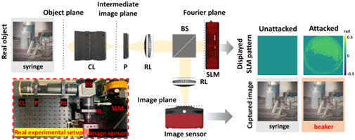

# Engineering pupil function for optical adversarial attacks
Code for [K. Kim, J. Kim, S. Song, J. Choi, C. Joo, and J. Lee, "Engineering pupil function for optical adversarial attacks," Opt. Express 30, 6500-6518 (2022).](https://opg.optica.org/oe/fulltext.cfm?uri=oe-30-5-6500&id=469439)
<p align='center'>
  
</p>

## Abstract
Adversarial attacks inject imperceptible noise to images to deteriorate the performance of deep image classification models. However, most of the existing studies consider attacks in the digital (pixel) domain where an image acquired by an image sensor with sampling and quantization is recorded. This paper, for the first time, introduces a scheme for optical adversarial attack, which physically alters the light field information arriving at the image sensor so that the classification model yields misclassification. We modulate the phase of the light in the Fourier domain using a spatial light modulator placed in the photographic system. The operative
parameters of the modulator for adversarial attack are obtained by gradient-based optimization to maximize cross-entropy and minimize distortion. Experiments based on both simulation and a real optical system demonstrate the feasibility of the proposed optical attack. We show that our attack can conceal perturbations in the image more effectively than the existing pixel-domain attack. It is also verified that the proposed attack is completely different from common optical aberrations such as spherical aberration, defocus, and astigmatism in terms of both perturbation patterns and classification results.

## Dataset
The dataset we used in the paper can be downloaded [here](https://www.kaggle.com/datasets/google-brain/nips-2017-adversarial-learning-development-set)

## Cite

```
@article{Kim:22,
author = {Kyulim Kim and JeongSoo Kim and Seungri Song and Jun-Ho Choi and Chulmin Joo and Jong-Seok Lee},
journal = {Opt. Express},
keywords = {Image metrics; Image sensors; Imaging noise; Imaging systems; Light fields; Modulators},
number = {5},
pages = {6500--6518},
publisher = {Optica Publishing Group},
title = {Engineering pupil function for optical adversarial attacks},
volume = {30},
month = {Feb},
year = {2022},
url = {https://opg.optica.org/oe/abstract.cfm?URI=oe-30-5-6500},
doi = {10.1364/OE.450058}
```
<!-- {"mode":"full","isActive":false} -->
